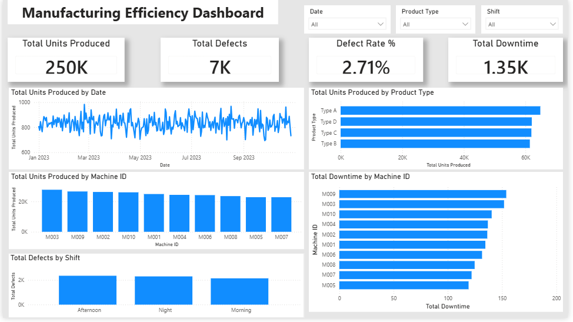
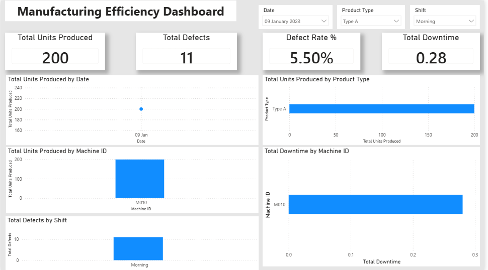

# Manufacturing Efficiency Dashboard (Power BI)

📊 An interactive Power BI dashboard for monitoring manufacturing performance through production, quality, and operational KPIs.

---

## Dashboard Preview

### Dashboard Overview



### Dashboard with Filters Applied



---

## Project Overview

This project demonstrates how Power BI can be used to analyze manufacturing operations through interactive dashboards and business intelligence techniques. The dashboard provides decision-makers with real-time insights into production efficiency, machine performance, downtime, defect rates, and product performance.

---

## Business Problem

Manufacturing organizations generate large volumes of operational data every day. Without a centralized reporting solution, it becomes difficult to monitor production efficiency, identify quality issues, and track machine performance.

This dashboard provides an interactive reporting solution that helps users:

- Monitor production output
- Track defect rates
- Analyze machine performance
- Identify downtime patterns
- Compare product performance
- Filter insights by Date, Product Type, and Shift

---

## Key Performance Indicators (KPIs)

- 📦 Total Units Produced
- ⚠️ Total Defects
- 📉 Defect Rate (%)
- ⏱ Total Downtime (Hours)

---

## Dashboard Features

- Interactive slicers (Date, Product Type, Shift)
- Production trend analysis over time
- Product-wise production comparison
- Machine-wise production analysis
- Machine-wise downtime analysis
- Shift-wise defect analysis
- KPI cards with DAX measures
- Clean and interactive dashboard design

---

## Tools & Technologies

- Power BI Desktop
- Power Query
- DAX (Data Analysis Expressions)
- CSV Dataset

---

## Dataset

This project uses a **synthetic manufacturing dataset** created exclusively for portfolio and educational purposes.

The dataset contains information such as:

- Production Date
- Machine ID
- Product Type
- Shift
- Units Produced
- Defects
- Downtime (Hours)

---

## Repository Contents

```
Manufacturing_Efficiency_Dashboard.pbix
Manufacturing_Efficiency_Dataset.csv
dashboard_overview.png
dashboard_filtered.png
README.md
LICENSE
```

---

## Skills Demonstrated

- Data Cleaning
- Data Modeling
- DAX Measures
- KPI Development
- Interactive Dashboard Design
- Data Visualization
- Business Intelligence
- Manufacturing Analytics

---

## Key Insights

- Monitor overall manufacturing efficiency at a glance
- Identify high-performing and underperforming machines
- Compare production across product categories
- Analyze production trends over time
- Monitor defect rates across different shifts
- Track machine downtime for operational improvements

---

## Future Improvements

- Drill-through pages
- Advanced DAX calculations
- Forecasting and predictive analytics
- Row-Level Security (RLS)
- Power BI Service deployment
- Automated data refresh

---

## Author

**Nikita Bhandari**

GitHub: https://github.com/bhandari-nikita

---

⭐ If you found this project interesting, consider giving the repository a star.
